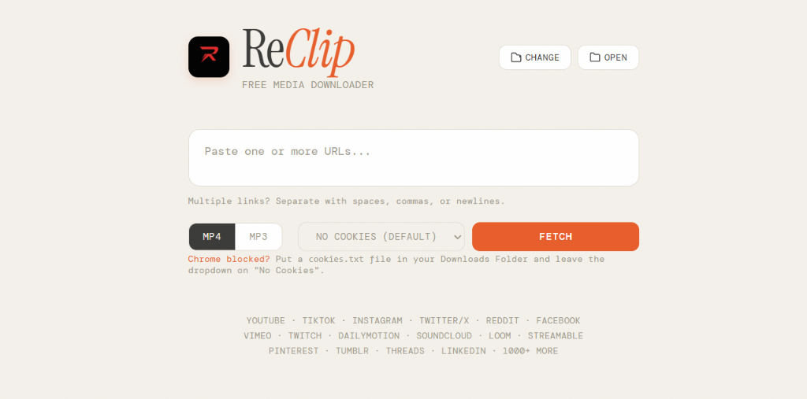

<div align="center">
  

  # ReClip — Windows Desktop Media Downloader

  **A sleek, native Windows desktop application for media downloading.**  
  Download videos and audio from YouTube, TikTok, Instagram, Twitter/X, and 1000+ other sites in MP4 or MP3 format with real-time progress indicators and file size estimation.

  

  
  
  
  
</div>

---

## ✨ Features

- **🚀 Native Windows Desktop Application**: Embedded Microsoft Edge WebView2 GUI window—no browser tabs or `http://localhost:8899` server URLs required.
- **⚡ Windowless & Silent Operations**: Zero command prompt or terminal windows popping up during fetching or downloading.
- **📊 Real-Time Progress Bar & File Size Estimation**: View percentage progress bar, live download speeds (`MiB/s`), ETAs, and estimated/final file sizes.
- **📁 One-Click Downloads Folder Access**: Quick button to open system file explorer directly to your downloaded media (`Downloads/ReClip`).
- **🎵 MP4 Video & MP3 Audio Extraction**: Easily choose between video and audio extraction.
- **🌐 1000+ Supported Platforms**: YouTube, TikTok, Instagram, Twitter/X, Reddit, Facebook, Vimeo, Twitch, SoundCloud, Pinterest, Loom, Threads, and many more.

---

## 💾 Downloads & Installation

### Windows Desktop (.exe)
1. Download **`ReClip_v1.2.0_Setup.exe`** from [GitHub Releases](https://github.com/Fazzbro/Reclip/releases/tag/v1.2.0) and run the installer.
2. Alternatively, launch `dist/ReClip/ReClip.exe` directly.

---

## 🍪 Setup Guide: YouTube & Chrome DPAPI Bypass

Google Chrome 127+ introduced **App-Bound Encryption**, preventing third-party apps like ReClip from automatically extracting cookies directly from the browser while it's running. This leads to `ERROR: Could not copy Chrome cookie database` or `Failed to decrypt with DPAPI` when downloading YouTube videos.

**To bypass this permanently:**
1. Open Google Chrome.
2. Go to `chrome://extensions/` and enable **Developer Mode**.
3. Click **Load unpacked** and select the `chrome_extension` folder found inside this repository.
4. Click the newly installed **ReClip Cookie Exporter** extension icon and click **"Export cookies.txt"**.
5. Save the downloaded `cookies.txt` file directly into your ReClip **Downloads Folder**.
6. Open ReClip, set the browser dropdown to **No Cookies (Default)**, and fetch your video! ReClip will automatically detect the `cookies.txt` file and bypass Chrome's security!

---

## 🛠️ Building from Source

### Building Windows Executable
```powershell
python build_windows_app.py
```
*Compiles `ReClip.exe` with the red "R" icon into `dist/ReClip/`.*

---

## 📄 License

This project is licensed under the [MIT License](LICENSE).
